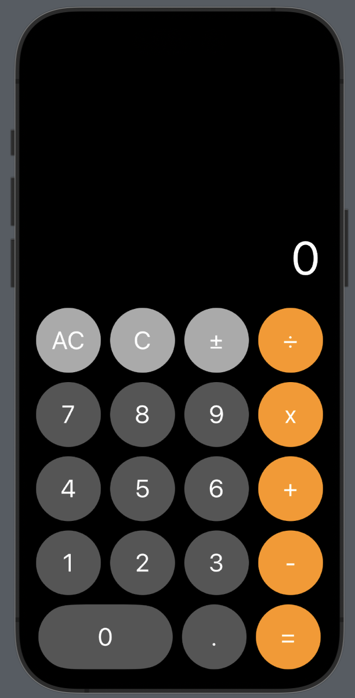

# Calculator

A simple calculator app built using SwiftUI.



## Features

- Perform basic arithmetic operations (addition, subtraction, multiplication, division).
- Toggle between positive and negative numbers.
- Clear the display or delete the last character.
- Calculate results with decimal numbers.

## Getting Started

1. Clone the repository:

```bash
git clone https://github.com/Serban2001/Calculator.git
```

2. Open the project in Xcode.

3. Build and run the app on the simulator or a physical device.

## Usage

Press buttons to input numbers and perform operations.

AC: Clear all.

C: Delete the last character.

±: Toggle between positive and negative.

=: Calculate the result.

## Technologies Used

- SwiftUI

- AVFoundation (for button click sound)
